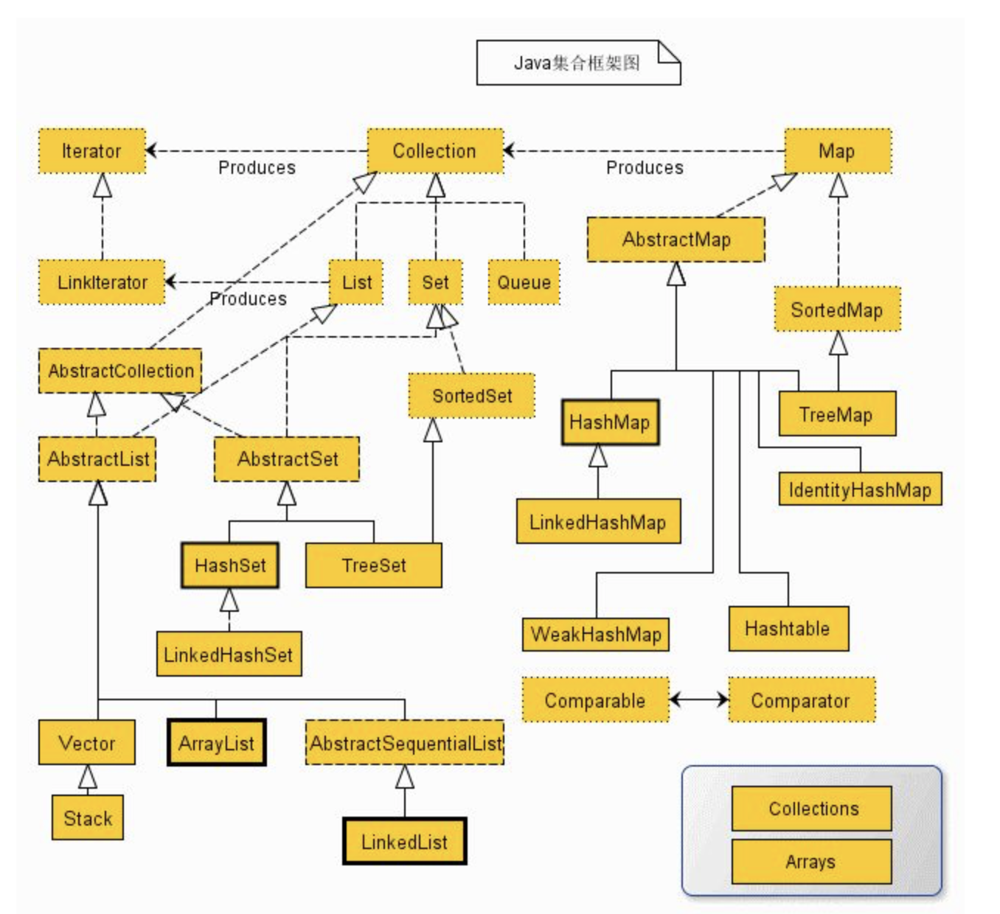

## Java 集合框架



从图上可以看出，Java 框架的继承图还是挺错综复杂的。所有集合类都位于`java.util`包下。而 Java 集合类由两个接口派生：Collection 和 Map。


## Collection

Collection 是一个高度抽象的集合，它包含了集合的基本操作。下面是它的 API

```java
abstract boolean         add(E object)  //添加元素
abstract boolean         addAll(Collection<? extends E> collection) //将指定集合中的所有元素添加到此集合
abstract void            clear()  //从此集合中删除所有元素
abstract boolean         contains(Object object)  //如果此集合包含指定的元素，则返回 true 
abstract boolean         containsAll(Collection<?> collection)  //如果包含指定集合中的所有元素，则返回 true 
abstract boolean         equals(Object object)  //将指定的对象与此集合进行比较以获得相等性，这个方法在之后会介绍到
abstract int             hashCode()   //返回此集合的哈希码值
abstract boolean         isEmpty()    //如果此集合不包含元素，则返回 true 
abstract Iterator<E>     iterator()   //返回此集合中元素的迭代器
abstract boolean         remove(Object object)  //从该集合中删除指定元素的单个实例（如果存在）
abstract boolean         removeAll(Collection<?> collection)  //删除指定集合
abstract boolean         retainAll(Collection<?> collection)  //仅保留此集合中包含在指定集合中的元素
abstract int             size()  //返回此集合中的元素数
abstract <T> T[]         toArray(T[] array)  //返回一个包含此集合中所有元素的数组
abstract Object[]        toArray()  //返回一个包含此集合中所有元素的数组; 返回的数组的运行时类型是指定数组的运行时类型
```


### List

List 是一个<u>有序</u>集合，它的顺序取决于它的插入顺序，并且可以通过下表访问 / 元素查找。<u>List 允许重复元素</u>，包括<u>重复添加 null 元素</u>。List 提供了四种索引定位的方法来访问列表元素。列表(如Java数组)是基于零的。

List 提供了一个特殊的迭代器，称为 ``ListIterator``，允许插入和替换元素。除此之外，还提供了双向列表访问机制，从指定位置开始列表迭代。

List 的常见子类有 ArrayList 和 LinkedList。

关于时间复杂度：

| 实现       | 复杂度                                    |
| :--------- | ----------------------------------------- |
| ArrayList  | 查 O(1） 增 末尾 O(1）中间 O(n） 删 O(n） |
| LinkedList | 查 O(n） 增 末尾 O(1）中间 O(n） 删 O(1） |

### Set

Set 和 List 很多地方都相反。Set 是<u>无序</u>的，而且<u>不允许重复元素</u>，<u>允许添加一个 null 元素</u>。

虽然 Set 定义不允许空元素，实际上其子类在实现上会有一些偏差。例如说，有子类不允许 null，有些子类只允许其限制的类型的元素。当你想添加一个不合法元素的时候，可能会抛出 NullPointerException 或 ClassCastException；当你查询一个不合法的时候，可能会抛出异常或者返回 false。这个取决于子类的选择。

对于特性``不允许重复元素``，主要是取决于 HashCode 和 Equals 函数。无论你是同一个对象的同种实例化，或者是不同对象的不同实例化，只要两者 hashCode 和 equals 相同，那就不允许添加进 Set 里面。

Set 常见的子类有 HashSet 和 TreeSet，LinkedHashSet。

关于时间复杂度：

| 实现          | 复杂度                                 |
| ------------- | -------------------------------------- |
| HashSet       | 查 O(1） 增 O(1） 删 O(1）             |
| TreeSet       | 查 O(log n） 增 O(log n） 删 O(log n） |
| LinkedHashSet | 查 O(1） 增 O(1） 删 O(1）             |


## Map

Map 是一个 Key-Value 的映射器。Map 定义了不能存在相同的两个 Key，同时一个 Key 仅仅能映射 Value。Map 提供了三种便利性的集合视图，包括了以 Set 的形式访问 Key / 以集合形式访问其 Values / 还有 Set 形式的 Key-Value 映射。

另外 Map 还有其他的特点：

1. 关于顺序问题，是 Map 集合视图上的迭代器返回集合视图的顺序。另外一些 Map 的实现 TreeMap 可以设定顺序，但是 HashMap 却不行。
2. 在 Map 中尽量不要使用可变对象作为 Key。因为 Map 在查找的时候会通过计算 hash 值来找到指定对象。但是因为可变对象的 hashCode 可能改变后，Map 可能就找不到它了。
3. 

Map 常见的子类有 HashMap 和 LinkedHashMap 和 TreeMap 等。

关于时间复杂度：

| 实现          | 复杂度                                                       |
| ------------- | ------------------------------------------------------------ |
| HashMap       | O(log n)                                                     |
| TreeMap       | 平均能达到 O(1)。正常是 0(1) 到 0(n） JDK 1.8 添加了红黑树是 O(log n) |
| LinkedHashMap | 平均达到 O(1)                                                |


## List  / Set / Map 总结

- List 集合是有序集合，集合中的元素可以重复，访问集合中的元素可以根据元素的索引来访问。
- Set 集合是无序集合，集合中的元素不可以重复，<u>访问集合中的元素只能根据元素本身来访问</u>（也是集合里元素不允许重复的原因）。
- Map 集合中保存 Key-Value 对形式的元素，访问时只能根据每项元素的 Key 来访问其 Value。

